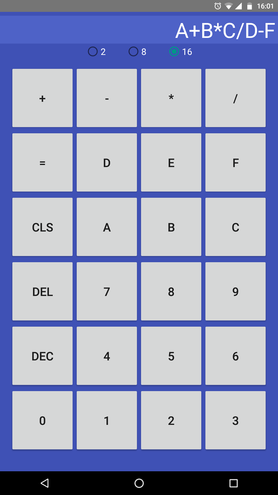

# Number System Calculator

An Android app to perform addition, subtraction, multiplication and division on base 2, 8 and 16 numbers.

## Features:

* Performs math operations [+, -, *, /] on base 2, base 8 and base 16 expressions.

* Converts valid expressions between number systems.

  * DEC button: converts the expression into decimal.
  * Going through number systems: converts the expression into that number system.

  ​

## Screenshots

 | width=400

 | width=400

 | width=400
